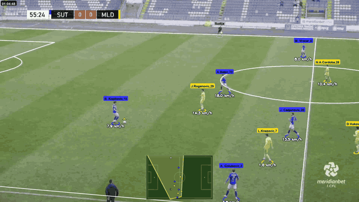
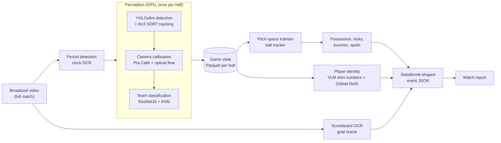
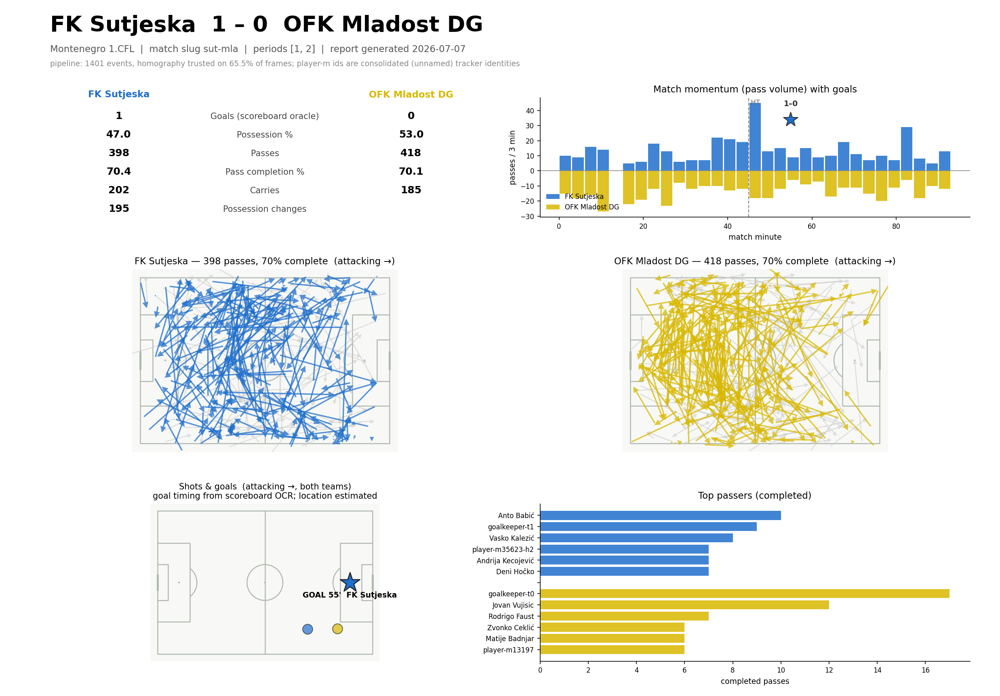

# Football Computer Vision

Match event data (passes, carries, possession, goals and who made them) extracted from
single-feed broadcast video of Montenegro's First League (1.CFL), a league that no commercial
data provider covers.

<p align="center">
  <a href="docs/media/demo.mp4">
    
  </a>
  <br><em>Sutjeska vs Mladost, 55'. Tracked players with names and shirt numbers, live speed,
  the pitch model projected onto the broadcast, and a minimap of the camera's view.
  <a href="docs/media/demo.mp4">Full 18-second clip (MP4)</a>. This clip uses
  hand-calibrated homography keyframes and hand-mapped names; the match pipeline below runs
  without them.</em>
</p>

## At a glance

The input is a full-match broadcast recording: one camera feed with pans, zooms, replays and
close-ups, as produced for a small league. The output is a StatsBomb-v4-shaped event stream per
match and a one-page analyst report. In between, a fine-tuned YOLOv8m detects players and the
ball, BoT-SORT tracks them, a pretrained PnLCalib model calibrates the camera so image pixels
map to pitch metres, and all of it is persisted once as a per-frame *game state* in Parquet.
Everything downstream reads that artifact instead of the video; ball tracking, possession and
events run on the CPU and iterate in seconds.

Measured against SofaScore on 7 full matches, team possession is within **4.0 percentage
points** and the pass split between teams within **3.9 pp**; the final score, read from the
broadcast's own scoreboard graphic, matched the real result on **7 of 7** matches. Passes are
attributed to a named player automatically (VLM shirt-number reading plus appearance
re-identification) for **61% of pass events**, with a 20-30 minute human verification pass per
match to confirm or reject the proposed identities.



## What it produces

For every processed match: `output/events/{slug}_events.json`, a StatsBomb-v4-shaped event stream
(passes with length, angle and outcome, carries, ball receipts, recoveries, restarts with
`play_pattern`, goals, possession sequences, attack-normalised 120x80 locations plus native
metres) and a one-page report rendered from it.

<p align="center">
  
  <br><em>Report generated end to end from the broadcast. The 1-0 score and the 55th-minute goal
  come from the scoreboard oracle; possession is within 2 pp and the pass split within 0 pp of
  SofaScore for this match.</em>
</p>

## How it works

1. **Period detection** ([broadcast.py](src/broadcast.py)). The match clock is OCR'd with easyocr
   on 60 frames sampled across the broadcast and extrapolated back to the two kickoff frames.
   Unsupervised; correct on 15 of 16 matches, and the 16th is flagged because its source
   recording genuinely starts three minutes into the second half.
2. **Detection and tracking** ([pipeline.py](src/pipeline.py), [detection.py](src/detection.py)).
   YOLOv8m fine-tuned on 971 hand-labelled frames from all 16 matches (two classes, person and
   ball), with BoT-SORT for persistent track ids.
3. **Camera calibration** ([run_pnlcalib_video.py](src/run_pnlcalib_video.py),
   [camera_motion.py](src/camera_motion.py), [stabilize.py](src/stabilize.py)). PnLCalib
   (HRNetV2) predicts pitch keypoints and lines and returns a 3x4 projection matrix. Each
   projection must pass a player-on-pitch sanity check and a line-alignment check against the
   painted lines in the frame; Lucas-Kanade optical flow carries the calibration across frames
   where the model fails, and an offline smoothing pass removes jitter. Frames only count as
   *trusted* above a per-match confidence threshold, and events are only emitted on trusted
   wide-shot frames.
4. **Game state** ([game_state.py](src/game_state.py)). Per half, one row per player per frame
   (bounding box, pitch coordinates, team), every raw ball candidate, and the camera matrix with
   its confidence. Perception runs once (about 10 hours of GPU time per match); everything after
   this point reads the Parquet files, not the video.
5. **Ball tracking** ([ball_tracker.py](src/ball_tracker.py)). YOLO loses the ball on roughly 45%
   of frames, mostly during passes. A constant-velocity Kalman filter in *pitch* coordinates
   bridges those gaps: the camera pans to follow the ball, so image-space extrapolation is wrong
   exactly when it is needed, while the ground track of a pass is close to a straight line. Gaps
   bounded by detections at most 2.4 s apart are back-filled in hindsight.
6. **Events** ([events.py](src/events.py)). A possession-then-event decision tree: ball carrier
   per frame, explicit kick detection from ball-velocity discontinuities, debounced touches,
   possession spells, then Pass / Carry / Shot / Ball Recovery at spell boundaries. Dead-ball
   logic suppresses play from the moment the ball leaves the pitch, or parks, until the restart,
   which is classified as a throw-in, corner or goal kick.
7. **Goals** ([score_ocr.py](src/score_ocr.py)). Goals often happen on a close-up camera where
   tracking is correctly paused, so they are read from the broadcast instead: the scoreboard is
   sampled every 10 s, both of the league's graphic layouts are parsed, and each monotonic score
   change becomes a goal anchored to the last reading of the old score (about 1 s after the ball
   crosses the line on the verified case).
8. **Player identity** ([jersey_vlm.py](src/jersey_vlm.py), [reid.py](src/reid.py),
   [identity_propagation.py](src/identity_propagation.py), [track_split.py](src/track_split.py),
   [team_cluster.py](src/team_cluster.py)). Every camera cut ends a track, so a half produces
   hundreds of track fragments. Qwen2-VL-2B reads shirt numbers from back-of-shirt crops
   (17 ms per crop on an RTX 5070), numbers are voted per track under structural consistency
   gates, and OSNet appearance embeddings link a player's fragments across cuts. Tracks whose
   number readings switch mid-life are split at the switch, since they are ID swaps. The same
   embeddings, clustered, assign teams without any per-match labelling.
9. **Human verification** ([verify_ui.py](src/verify_ui.py)). A self-contained HTML page per
   half shows each proposed identity with crops and a short video clip from different fragments,
   so a wrong merge is visible at a glance. The reviewer confirms (attaching the lineup name) or
   rejects; rejections become vetoes the next rebuild respects. About 10 minutes per half.

`python -m src.run_match --match X --home_team N` runs the whole chain for one match and is
resumable step by step.

## Evaluation

Three independent references, each measuring a different layer.

### Detection

YOLOv8m on three held-out matches (the train/validation split is by match, not by frame, so no
game appears on both sides).

| mAP50 | mAP50-95 | precision | recall |
|---|---|---|---|
| 0.944 | 0.748 | 0.952 | 0.892 |

Training curves: [models/detection/results.png](models/detection/results.png).

### Events against a hand-labelled golden set

Six segments where every ball contact was labelled frame by frame
([data/golden_events/](data/golden_events/), scored by [golden_eval.py](src/golden_eval.py)).
Two segments were chosen specifically because they are hard.

| segment | conditions | golden passes | precision | recall | carrier accuracy |
|---|---|---|---|---|---|
| sut-mla, 1st half (2 windows) | daylight, clear camera | 16 | 0.79 | 0.94 | 98% |
| sut-mla, 2nd half | daylight, clear camera | 8 | 0.88 | 0.88 | 99% |
| bud-sut, 1st half | daylight, multi-camera | 3 | 1.00 | 1.00 | 100% |
| **good conditions, pooled** | | **27** | **0.83** | **0.93** | |
| bok-jed, 1st half | partial calibration, crowded box | 3 | 0.00 | 0.00 | 53% |
| jez-jed, 1st half | 37 s stoppage around a free kick | 2 | 0.00 | 0.00 | 43% |

Where the camera is calibrated the event logic is accurate. The two failures have named causes:
bok-jed loses whole possession intervals to untrusted calibration, and jez-jed exposed passes
invented between players standing over a parked ball during a stoppage, which led to a
parked-ball dead-time rule, and a static off-pitch false ball detection that the tracker
oscillates towards (the next fix).

### Match level against SofaScore

Seven full matches ([sofa_eval.py](src/sofa_eval.py)). Possession and pass split are
coverage-invariant: they compare shares, so they stay meaningful when only part of the match is
calibrated. "Trusted" is the share of frames with a trusted camera calibration.

| match | possession (SofaScore / ours) | error | pass split error | trusted |
|---|---|---|---|---|
| sut-mla | 45-55 / 47-53 | 2 pp | 0 pp | 66% |
| jez-jed | 52-48 / 51-49 | 1 pp | 4 pp | 65% |
| jez-ars | 44-56 / 49-51 | 5 pp | 5 pp | 71% |
| dec-mla | 49-51 / 53-47 | 4 pp | 1 pp | 35% |
| jed-ars | 64-36 / 55-45 | 9 pp | 10 pp | 46% |
| mla-bud-2 | 51-49 / 53-47 | 2 pp | 1 pp | 25% |
| sut-pet | 56-44 / 62-38 | 6 pp | 6 pp | 25% |
| **mean** | | **4.0 pp** | **3.9 pp** | |

Player level, pooled over the same seven matches: 61% of pass events are attributed to a
numbered player, 153 of the 210 players in SofaScore's line-ups are identified, and per-player
pass counts correlate with SofaScore at Spearman rho 0.43. The scoreboard oracle matched the final
score on all seven. The full stage-by-stage history, including what was tried and reverted, is in
[docs/CAPABILITY_ASSESSMENT.md](docs/CAPABILITY_ASSESSMENT.md).

## Design decisions that came from measurement

- **Classical homography was dropped.** A Hough-line pipeline scored well on reprojection error
  and produced 0 of 15 visually correct calibrations. Calibrations are judged by overlaying the
  pitch on the frame, not by the solver's own residual.
- **The calibration trust threshold is per match.** The line-alignment score separates good from
  bad projections *within* a match, but its scale depends on paint and floodlights (correct
  calibrations on a floodlit match scored 0.12-0.53, where daylight ones score close to 1.0). Loosening the
  white-pixel mask instead was tested and inflated a known-wrong frame from 0.64 to 1.00, so the
  threshold adapts to each match's own distribution instead.
- **Team-classifier embeddings carry no identity signal.** ResNet18 features separate kits but
  rank a same-player pair above a different-teammate pair only 43% of the time (chance). OSNet,
  trained for person re-identification, reaches 83.5%, and that gap is what made cross-cut
  identity possible.
- **A VLM beats OCR on shirt numbers.** easyocr's text detector misses most back-of-shirt
  numbers; Qwen2-VL-2B produced 5-15x more confident numbers per half with no wrong answers on the
  hand-labelled tracks. Lowering the minimum crop height from 90 to 70 px to gain coverage was
  measured to make every metric worse, so it stays at 90.
- **Goals come from the scoreboard, not from tracking.** The first complete match's only goal
  happened on a close-up where tracking is correctly paused; the oracle catches it, with its
  timing verified against the frame where the ball crosses the line.

## Limitations

- **Calibration coverage bounds everything.** Night matches and low, oblique stadium cameras sit
  outside PnLCalib's training distribution; trusted coverage ranges from 25% to 71% per match,
  and absolute event counts scale with it. A PnLCalib fine-tune on league frames, seeded by the
  57 hand calibrations in [data/manual_calibration/](data/manual_calibration/), is the main open
  lever.
- **Shots other than goals are not detected reliably.** The detector reports only clear on-target
  attempts; shot outcomes other than goals are left unknown.
- **Restarts are over-detected** (about 3x the true throw-in count) because calibration error near
  the touchline parks the ball estimate on the line. Pass precision is unaffected; `play_pattern`
  tags are over-applied.
- **Per-player counts are thin for players seen mostly on uncalibrated frames**, which holds the
  rank correlation down even when the identity itself is right.

## Repository layout

```
src/                 pipeline modules (perception, game state, ball tracking, events,
                     identity, scoreboard OCR, report, evaluation, review UIs)
scripts/             batch utilities (verification contact sheets, golden-set labelling sheets,
                     full re-processing of one match)
notebooks/           team-classification labelling, homography inspection, event QC,
                     demo-clip rendering, detector training
data/
  object_detection/  971 labelled frames' YOLO labels (images not included) + CVAT export
  golden_events/     hand-labelled ball-contact ground truth for 6 segments
  manual_calibration/  57 hand-calibrated camera matrices (demo keyframes, fine-tune seed)
models/detection/    fine-tuning config, metrics and curves (weights not included)
docs/                capability assessment; README media
```

## Running it

Requires Python 3.10+, an NVIDIA GPU for perception, and `ffmpeg`. Model weights (the fine-tuned
YOLOv8m, PnLCalib, OSNet) and the match videos are not in the repository.

```bash
pip install -r requirements.txt

# Whole chain for one match: perception (both halves) -> stabilise -> shirt numbers
# -> scoreboard oracle -> events -> report. Resumable; roughly 10 h of GPU time.
python -m src.run_match --match sut-mla --home_team 1

# Individual stages, all reading the persisted game state (CPU, seconds to minutes)
python -m src.ball_tracker --match sut-mla --half 1
python -m src.events --match sut-mla
python -m src.report --match sut-mla

# Human verification page for one half, then apply the exported verdicts
python -m src.verify_ui --match sut-mla --half 1 --clips
python -m src.verify_ui --apply verdicts.json

# Evaluation
python -m src.golden_eval --match sut-mla --half 1
python -m src.sofa_eval --players
```

## Tech stack

PyTorch, Ultralytics YOLOv8 and BoT-SORT, PnLCalib (HRNetV2-W48), torchreid (OSNet-AIN),
Hugging Face Transformers (Qwen2-VL-2B), easyocr, OpenCV, scikit-learn, pandas and PyArrow,
mplsoccer. Developed on Windows 11 with an RTX 5070 (CUDA 12.8).

## License

[MIT](LICENSE).
